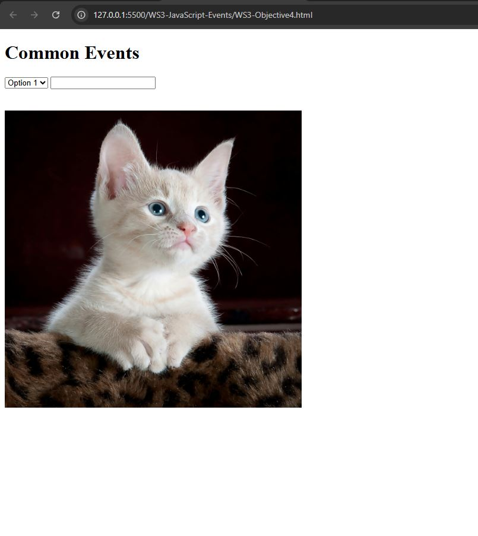

# WS3 Accessing the Files 

1. Save the files to your local computer.

2. Open the indiviual file into your browser.

3. See console output by opening browser developer tools. Shortcuts for Windows/Linux: Press F12 or Ctrl + Shift  + I. Shortcuts for Mac: Press Cmd + Opt + I

4. Interact with the various features on webpage, to see the results. For example Obj 4 has screenshot below as to what it should look like in your browser.

# Objective Tasks

[Understanding HTML Events and Common Examples](WS3-Objective1.html)

[Handling Events Using HTML Attributes](WS3-Objective2.html)

[Using Named Functions for Cleaner Event Handling](WS3-Objective3.html)

[Identifying and Using Common JS Events](WS3-Objective4.html)

[Adding and Removing Event Listeners Dynamically](WS3-Objective5.html)

[Attaching Multiple Event Listeners to the Same Element](WS3-Objective6.html)

[Considering Browser Compatibility](WS3-Objective7.html)

# Example of Objective 4 screenshot

