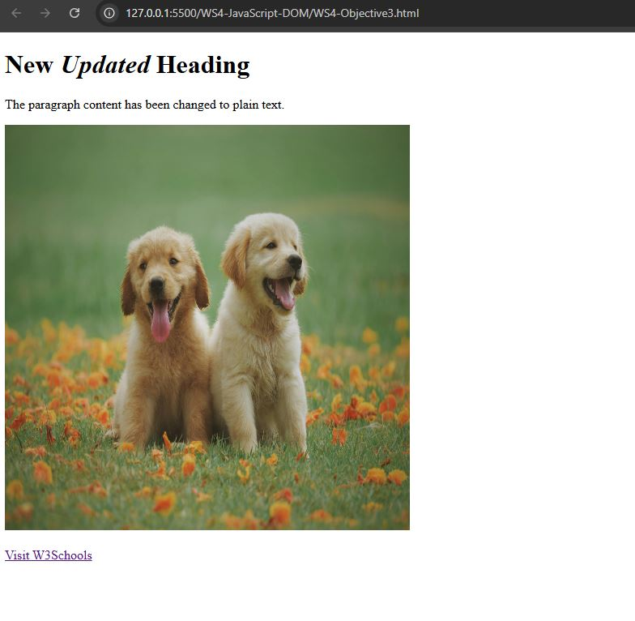

# WS4 Accessing the Files 

1. Save the files to your local computer.

2. Open the indiviual file into your browser.

3. See console output by opening browser developer tools. Shortcuts for Windows/Linux: Press F12 or Ctrl + Shift  + I. Shortcuts for Mac: Press Cmd + Opt + I

4. Interact with the various features on webpage, to see the results. For example Obj 3 has screenshot below as to what it should look like in your browser.

# Objective Tasks

[Understanding the Document Object Model (DOM)](WS4-Objective1.html)

[Finding and Selecting HTML Elements](WS4-Objective2.html)

[Changing HTML Content and Attributes](WS4-Objective3.html)

[Modifying CSS Styles and Applying Animations](WS4-Objective4.html)

[Dynamically Creating and Adding New Elements](WS4-Objective5.html)

# Example of Objective 3 screenshot

# Learnings of WS4 

This module was to learn of the importance, and various different uses of DOM scripting. How effective it is to locate elements to manipulate and change different attributes. As well, as adding more style to page elements, or dynamically changing styles without refreshing the page and dynamically creating or adding new elements.